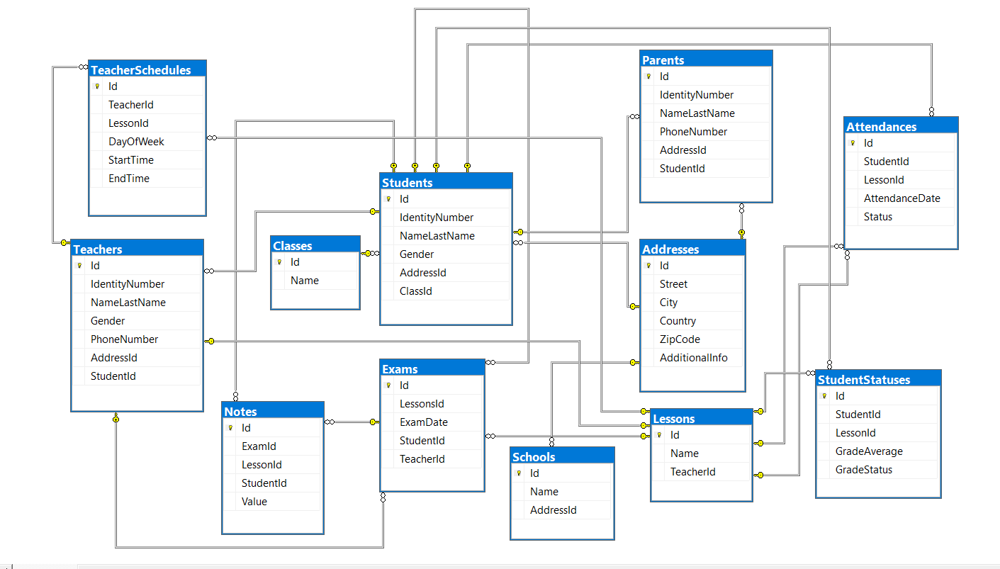

## SchoolDB Veritabanı Projesi
Bu script, **SchoolDB** adlı bir SQL veritabanı oluşturur. Bu veritabanı, bir okulun öğrencileri, öğretmenleri, dersleri, sınavları, devamsızlıkları ve diğer ilişkili bilgilerini içeren verileri depolar.

## School Veritabanı Diyagramı

